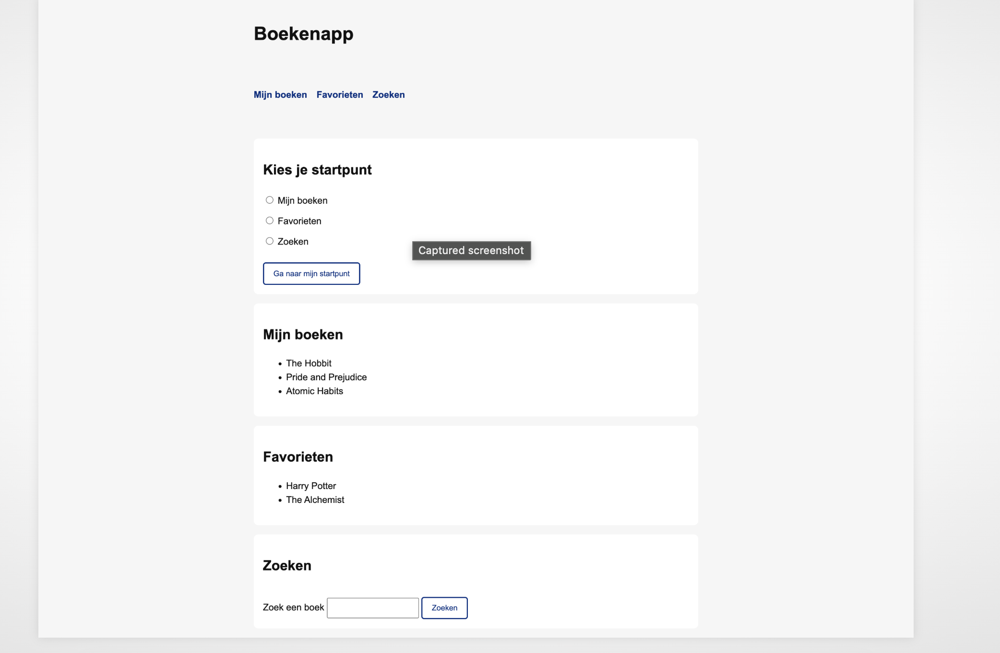
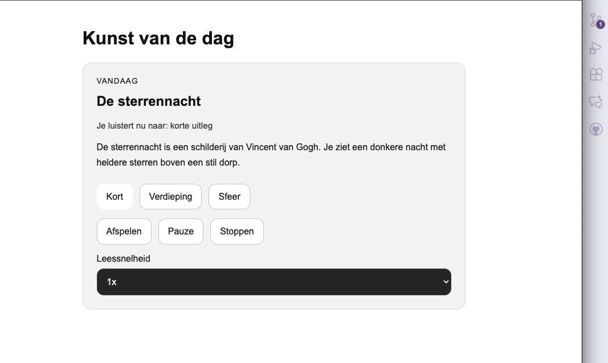
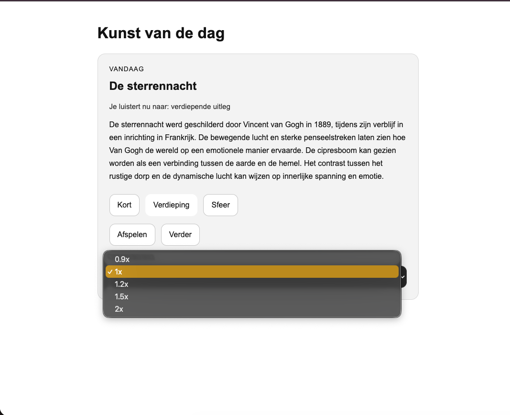
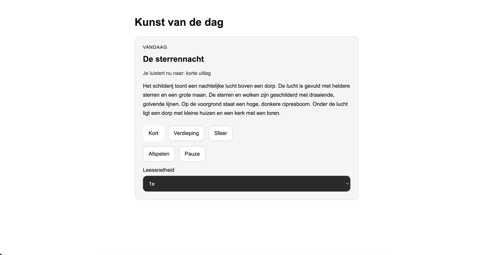

## 30 maart
(Ik was aan het begin van de dag afwezig vanwege ziekte; ik was er om 12.30 uur)
Ik ben begonnen met het opschrijven van ideeën en probeer de situatie van Ihab te begrijpen. De aannames die ik heb zijn:
- hij is blind
- hij gebruikt Screen Reader
- hij studeert economie en politicologie. Vanuit deze aannames begon ik na te denken over waar ik zou beginnen, maar eerlijk gezegd voelde ik me erg onzeker en vond ik het echt moeilijk om ergens mee te beginnen.

Toen ik in het begin probeerde de situatie van Ihab te begrijpen, koos ik het thema Voorkeuren, en van daaruit ging ik verder en bedacht ik iets in de trant van Goodreads dat hem zou helpen zijn leeservaring verder te ontwikkelen. Ik nam aan dat hij, gezien zijn studierichting politicologie, een zeer goede lezer is.

Ik heb inderdaad iets eenvoudigs gemaakt, namelijk dat de gebruiker een startpunt kiest wanneer hij de website opent. Dat wil zeggen dat hij kiest waar hij de navigatie op deze website wil beginnen. Als begin heb ik drie secties geplaatst: zoeken, boeken en favorieten. Morgen zal ik zien wat het resultaat van de test is.

## 31 maart  dinsdag

De test verliep naar mijn gevoel niet optimaal. Ik had moeite met het stellen van gerichte vragen en merkte dat ik de gebruiker niet altijd goed kon begeleiden tijdens het testen.
Daarnaast was het prototype nog niet volledig uitgewerkt. Toen de gebruiker de website opende, wachtte ik eerst af om te zien wat hij zou doen. Hierdoor ontstond er een moment van stilte.
Ik gaf vervolgens aan dat het idee was dat de gebruiker zou twijfelen waar hij moest beginnen.
De gebruiker gaf echter aan dat dit niet logisch is, omdat er al navigatie aanwezig was bovenaan de pagina.
Volgens hem is het verwarrend om nog een extra sectie te hebben om een keuze te maken.
Dit inzicht liet zien dat mijn concept op dit punt niet goed werkte.
Verder gaf de gebruiker aan dat het idee rondom boeken interessant is, maar stelde hij een belangrijke vraag:
wat voegt deze applicatie toe ten opzichte van bestaande platforms zoals Goodreads?
Hij suggereerde dat een richting zoals e-books mogelijk interessanter zou kunnen zijn.
-Inzichten: Test met gebruiker
Voor dit project heb ik een gebruikerstest uitgevoerd met een persoon die volledig afhankelijk is van een screenreader.
De gebruiker maakt gebruik van NVDA en navigeert voornamelijk met het toetsenbord.
Tijdens de test heb ik geobserveerd hoe de gebruiker door een prototype navigeerde en waar hij tegenaan liep.

Belangrijkste inzichten
 Audio
De gebruiker gaf aan dat controle over audio belangrijk is.
Hij ervaart frustratie wanneer audio niet gepauzeerd of hervat kan worden.
Ook worden lange spraakberichten vaak uitgesteld, omdat deze te veel tijd kosten.
- Audio moet dus flexibel en efficiënt zijn.

 Navigatie
Bij een nieuwe website is het moeilijk om te bepalen waar te beginnen.
Hoewel de gebruiker ervaren is met screenreaders, blijft een duidelijke structuur essentieel.
-Navigatie moet voorspelbaar en logisch zijn.

  Content
Lange teksten zijn lastig te volgen.
De gebruiker heeft behoefte aan duidelijke koppen en de mogelijkheid om snel tussen secties te navigeren.
-Structuur is belangrijker dan visuele vormgeving.

  Links en interactie
Onduidelijke links zorgen voor verwarring.
De gebruiker wil weten wat er gebeurt voordat hij ergens op klikt.
-Links moeten beschrijvend en duidelijk zijn.

  Terugkeren naar content
De gebruiker wil makkelijk terug naar eerder gelezen content.
-Een bookmark- of opsla-functie kan hierbij helpen.

*Vertaling naar ontwerp (Design decisions)
Op basis van deze inzichten heb ik de volgende keuzes gemaakt:
* Audio controls toegevoegd (pauze / hervatten)(als ik een audio functie ga gebruiken!)
* Duidelijke headings gebruikt (H1, H2…)
* Structuur verbeterd voor screenreaders
* Beschrijvende linkteksten toegepast
* Content opgesplitst in kleinere delen
* Mogelijkheid overwogen om content op te slaan (bookmark, en dat met boeken of artikelen website)

## Voortgangsgesprek week 1 

Ik heb mijn eerste concept uitgelegd en hoe mijn test is verlopen.
De test was deels negatief, omdat mijn idee een soort dubbeling had:
er waren twee navigatiemomenten (een startpunt én de navigatie binnen de website zelf), wat niet logisch was.
Feedback
* Ik moet meer vragen stellen over:
    * wat hij leuk vindt in apps
    * wat zijn hobby’s zijn
    * wat hij prefereert
* zodat ik een beter beeld van hem krijg
* Ik kan nadenken over de toon van de screenreader
Nieuw concept
Ik heb ook een nieuw concept bedacht:
een app met kunstwerken en bijhorende artikelen.
De kunstwerken worden uitgelegd samen met de sfeer ervan,
en er is ook een artikel over het kunstwerk zelf.
Voor het auditieve deel kan de gebruiker dingen zoals pauzeren.

## 7 April
### Test dag

De test op 7 april met Ihab verliep goed. Ihab werkte actief mee, dacht goed mee tijdens het gesprek en gaf verschillende bruikbare ideeën en suggesties. Daardoor leverde deze test waardevolle feedback op voor het verdere concept.
Belangrijkste feedback en inzichten
* Ihab gaf aan dat hij deze snelheid van de screenreader prettig vindt.(40)
* Hij vindt het een goed idee als er extra geluidseffecten worden toegevoegd, bijvoorbeeld bij knoppen of checkboxen, zodat je kunt horen of iets wel of niet is geselecteerd.
* Hij reageerde positief op interactieve elementen. Een concept met meer beleving of interactie sprak hem aan.
* Hij stelde een belangrijke vraag: hoe weet ik waar ik ben op de pagina? Dit laat zien dat oriëntatie en duidelijke structuur erg belangrijk zijn.
* Hij gaf aan dat hij graag meer betrokken wil worden bij de inhoud en de ervaring.
* Naast alleen tekstuele beschrijvingen vindt hij het interessant als ook de sfeer van een beeld wordt overgebracht, zoals:
    * de layout
    * de achtergrond
    * vormen en lijnen
    * of de sfeer blij, rustig, donker of boos aanvoelt
* Ook de toon van de screenreaderstem is belangrijk. Niet alleen wat er gezegd wordt, maar ook hoe prettig en duidelijk het klinkt.
* Tijdens de test kwam ook de vraag naar voren welke stem het fijnst is om naar te luisteren, bijvoorbeeld een mannen- of vrouwenstem.
* Meer details in beschrijvingen kunnen helpen, bijvoorbeeld over kleuren, licht, of het zonnig of bewolkt is.
Mijn conclusie uit de test
De test was waardevol, omdat Ihab niet alleen antwoord gaf op vragen, maar ook zelf extra ideeën aandroeg. Uit deze test werd voor mij duidelijk dat een persoonlijke en prettige luisterervaring belangrijk is. Ihab lijkt een meer persoonlijke stem fijner te vinden om naar te luisteren. Ook zou achtergrondmuziek of subtiele audio mogelijk iets kunnen toevoegen aan de beleving.
Tegelijkertijd kreeg ik ook nieuwe vragen over de technische kant van het concept. Ihab vroeg bijvoorbeeld:
* hoe de content wordt toegevoegd
* of dit vanuit een museum of een online bron zou gebeuren
* en of het concept als website, tool of extensie zou moeten werken
Wat ik meeneem
Door deze test heb ik beter inzicht gekregen in wat belangrijk is voor de gebruiker:
* duidelijke oriëntatie
* meer sfeer in de beschrijving
* prettige en persoonlijke audio
* en een duidelijk idee van hoe de inhoud technisch aangeboden wordt

## Voortgangsgesprek – 10 april

Feedback van de docent

De docent gaf aan dat er verschillende manieren zijn om een kunstwerk uit te leggen:

* Letterlijke beschrijving (natural explanation)
Hierbij ligt de focus op het visuele aspect van het werk:
   * wat er precies te zien is
   * de vormen en compositie
   * kleuren en details
   * hoe het object of kunstwerk is opgebouwd
* Interpretatieve uitleg (betekenis en context)
   Deze manier gaat meer de diepte in:
   * wat het symbool betekent
   * waarom het gebruikt is
   * wat de kunstenaar ermee wil zeggen
   * in welke context het werk is gemaakt (historisch/cultureel)
Dit zorgt voor meer koppeling met de sociale en culturele achtergrond van het kunstwerk.

* Technische en conceptuele richting
De docent stelde voor dat dit concept mogelijk als een web extensie kan werken, bijvoorbeeld op websites van musea zoals:
   * Rijksmuseum
   * Van Gogh Museum
Op zulke websites kan de gebruiker al bestaande informatie vinden, maar mijn concept kan daar een extra laag van audio en beleving aan toevoegen.

Extra opmerkingen
* Het idee om achtergrondmuziek toe te voegen voor sfeer is interessant, maar werd geadviseerd om dit pas later toe te voegen als er tijd over is.

## Week 3- maandag 13 april

Onderzoek – Museumwebsites
Deze week heb ik onderzocht hoe kunstwerken worden gepresenteerd op de websites van het Rijksmuseum en het Van Gogh Museum.

* Wat mij opviel
  * Beide websites bieden veel informatie over de kunstwerken, vooral in tekstvorm
  * De beschrijvingen gaan vaak in op de betekenis, de context en de kunstenaar (diepgaand)
  * Er is weinig aandacht voor een duidelijke visuele beschrijving van wat er daadwerkelijkb te zien is
  * Alles is gericht op lezen en kijken → er is geen audio-ondersteuning
  * De ervaring mist sfeer of emotie

* Wat neem ik hieruit mee
  * De huidige museumwebsites zijn sterk in inhoud, maar minder toegankelijk voor blinde gebruikers
  * Ik wil in mijn concept:
    * werken met audio in plaats van alleen tekst
    * verschillende manieren van uitleg aanbieden (kort, verdieping, sfeer)
    en meer focus leggen op de beleving van het kunstwerk

Prototype aanpassingen (voor de test)

Naast het onderzoek heb ik mijn prototype verder aangepast om het beter te kunnen testen met de gebruiker.

Wat heb ik toegevoegd deze week: 
* Een pauzeknop toegevoegd, zodat Ihab de audio kan stoppen en later verder kan luisteren vanaf hetzelfde punt
* Een oriëntatie-zin toegevoegd die vóór de audio wordt afgespeeld, zoals:“Je luistert nu naar korte / verdiepende / sfeer uitleg”

 ## Test week 3:
  * Tijdens de test met Ihab kwamen de volgende inzichten naar voren:
  * Te veel knoppen kunnen verwarrend zijn. De combinatie van pauze en stoppen werd als overbodig ervaren.
  * De drie vormen van uitleg (kort, verdieping, sfeer) lijken nog te veel op elkaar. Het verschil moet duidelijker worden.
  * De snelheidsopties liggen te dicht bij elkaar en mogen meer variëren.
  
  

Op basis van de feedback uit de test heb ik een aantal belangrijke aanpassingen aan mijn ontwerp doorgevoerd.

Aanpassingen:

* Herschrijven van de teksten
De uitleg bij de kunstwerken is herschreven en overzichtelijker gestructureerd.
Het is nu gemakkelijker om onderscheid te maken tussen de drie modi (beschrijving, betekenis en sfeer), die overeenkomen met de verschillende manieren van uitleggen.
* Uitbreiding van de snelheidsopties
Er is een extra snelheidsoptie (2x) toegevoegd, zodat de gebruiker meer controle heeft over de afspeelsnelheid.
Vereenvoudiging van de interface
* Overbodige knoppen zijn verwijderd.
De stopknop is verwijderd en vervangen door één duidelijke afspeel-/pauzeknop om de bediening eenvoudiger en minder verwarrend te maken.

Vertaald met DeepL.com (gratis versie)
## Bronen:
link naar de kunstwerk(ik heb hem voor het uitleg gebruikt):
<!--  https://www.vangoghstudio.nl/sterrennacht-van-vincent-van-gogh/ -->
link naar muziek:
<!-- https://pixabay.com/music/world-meditative-ambient-track-with-desert-wind-sounds-370136/ -->

Week 4 – Laatste iteratie op basis van feedback van Ihab

Tijdens deze laatste iteratie heb ik de feedback van Ihab uit de vorige test direct verwerkt in mijn prototype.
De focus lag hierbij minder op het concept zelf, en meer op het verbeteren van duidelijkheid, gebruiksvriendelijkheid en extra verdieping.

* Wat ik heb aangepast

  * Audiobediening verbeterd
De play- en pauzefunctie zijn samengevoegd in één duidelijkere knop
Een restartfunctie toegevoegd, zodat de audio opnieuw vanaf het begin afgespeeld kan worden
Dit maakt de controle over de audio logischer en intuïtiever
  * Benaming van de korte modus aangepast
“Kort” aangepast naar Korte samenvatting
Dit sluit beter aan bij de verwachting van de gebruiker en maakt duidelijker wat deze modus biedt
  * Statusmelding verduidelijkt
   * De statuszin “Je luistert nu naar…” behouden als oriëntatiepunt
   * De benamingen vereenvoudigd zodat de informatie duidelijker en minder overbodig aanvoelt
  * Extra verdieping toegevoegd als apart onderdeel
   * Op basis van Ihabs suggestie heb ik een aparte sectie toegevoegd met extra informatie over:
    * de kunstenaar
    *  historische context
   * Deze informatie staat los van de hoofdmodi, zodat de basiservaring overzichtelijk blijft terwijl extra verdieping optioneel beschikbaar is

### Study situation
Tijdens dit project heb ik verschillende tests uitgevoerd met Ehab om beter te begrijpen hoe hij websites gebruikt met behulp van een schermlezer.
Ik heb geobserveerd hoe hij door de website navigeert, welke moeilijkheden hij ondervindt en wat zijn voorkeuren zijn op het gebied van geluid, structuur en interactie.

###  Ignore conventions
In plaats van een traditionele museumwebsite die voornamelijk op tekst is gebaseerd, koos ik voor een ervaring die meer gericht is op geluid, sfeer en verschillende manieren van uitleg.
De focus lag minder op het visuele ontwerp en meer op de ervaring en toegankelijkheid.

### Prioritise identity
Het prototype is ontworpen volgens de persoonlijke voorkeuren van Ehab.
Tijdens de ontwikkelingsfasen hield ik rekening met zaken als:
* Geluidsregeling
* Geluidssnelheid
* Duidelijke begeleiding
* Verschillende soorten uitleg
* Een plezierige luisterervaring

### Add nonsense
Binnen dit project heb ik geprobeerd om verder te denken dan een standaard informatieve museumwebsite.
In plaats van alleen feitelijke informatie over kunstwerken te geven, wilde ik ook experimenteren met sfeer, emotie en beleving.

Test vragen:

-Zou jij een vast startpunt willen instellen?
-Welk onderdeel zou jij kiezen?
-Is dit handig of overbodig?
-Zou je liever iets anders kiezen als startpunt?
-welke apps Ihab gebruikt het meeste?
-wat heeft hij nodig?
-hij leest of niet?
-wat zijn interesses?
aannamens:
-hij is blend
-hij gebruikt screenreaders
-hij is zelfstandig

<header>
    <h1>Boekenapp</h1>
</header>

<nav>
    <ul>
        <li><a href="#mijn-boeken">Mijn boeken</a></li>
        <li><a href="#favorieten">Favorieten</a></li>
        <li><a href="#zoeken">Zoeken</a></li>
    </ul>
</nav>

<main>

    <!-- voorkeuren -->
    <section class="voorkeuren">
        <h2>Kies je startpunt</h2>

        <label>
            <input type="radio" name="startpunt" value="mijn-boeken">
            Mijn boeken
        </label>

        <label>
            <input type="radio" name="startpunt" value="favorieten">
            Favorieten
        </label>

        <label>
            <input type="radio" name="startpunt" value="zoeken">
            Zoeken
        </label>

        <button type="button" id="opslaan">Ga naar mijn startpunt</button>
    </section>

    <!-- sections -->
    <section id="mijn-boeken" tabindex="-1">
        <h2>Mijn boeken</h2>
        <ul>
            <li>The Hobbit</li>
            <li>Pride and Prejudice</li>
            <li>Atomic Habits</li>
        </ul>
    </section>

    <section id="favorieten" tabindex="-1">
        <h2>Favorieten</h2>
        <ul>
            <li>Harry Potter</li>
            <li>The Alchemist</li>
        </ul>
    </section>

    <section id="zoeken" tabindex="-1">
        <h2>Zoeken</h2>
        <label for="search">Zoek een boek</label>
        <input type="text" id="search">
        <button>Zoeken</button>
    </section>

</main>

* {
  box-sizing: border-box;
}

body {
  font-family: Arial, sans-serif;
  margin: 0;
  background: #f6f6f6;
  color: #111;
  line-height: 1.5;
}

/* layout */
header,
nav,
main {
  max-width: 50rem;
  margin: 0 auto;
  padding: 1rem;
}

/* nav */
nav ul {
  list-style: none;
  padding: 0;
  display: flex;
  gap: 1rem;
}

nav a {
  text-decoration: none;
  color: #003082;
  font-weight: bold;
}

/* sections */
section {
  background: white;
  padding: 1rem;
  margin-top: 1rem;
  border-radius: 0.5rem;
}

/* voorkeuren */
.voorkeuren label {
  display: block;
  margin: 0.5rem 0;
}

/* buttons */
button {
  margin-top: 1rem;
  padding: 0.6rem 1rem;
  border: 2px solid #003082;
  background: white;
  color: #003082;
  border-radius: 0.3rem;
  cursor: pointer;
}

/* input */
input {
  padding: 0.5rem;
  margin-top: 0.5rem;
}

/* focus */
a:focus,
button:focus,
input:focus,
section:focus {
  outline: 3px solid #ffc917;
  outline-offset: 3px;
}

